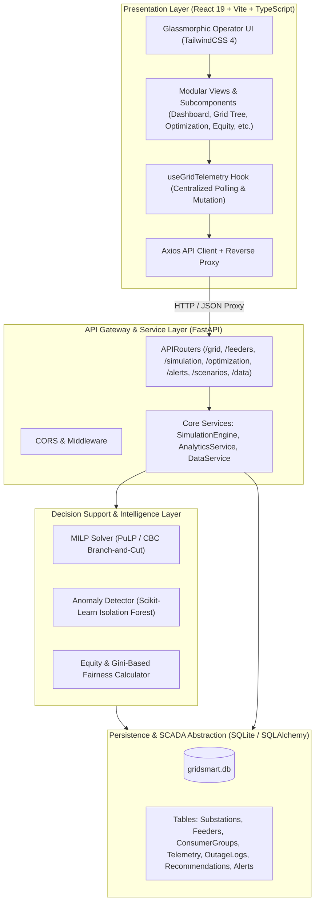
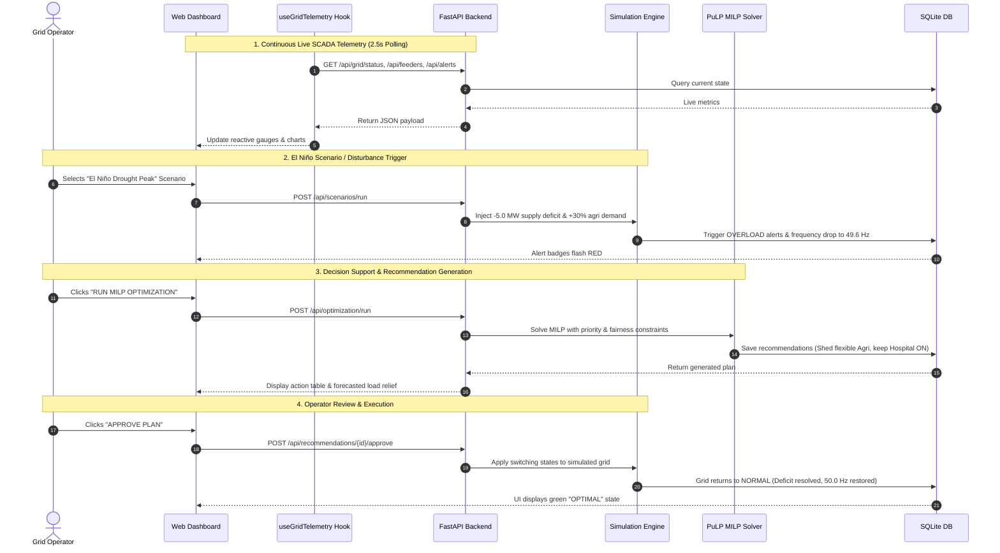

# GridSmart — Full Project Technical Explanation & Architecture Guide

> **Project Title:** GridSmart: AI & MILP-Driven Rural Feeder Decision Support & Load Management System  
> **Domain:** Smart Grid, Power Distribution Optimization, Decision Support Systems, Rural Electrification during Extreme Weather Events (El Niño / Droughts)  
> **Academic Context:** Third-Year Engineering Capstone Project

---

## 📑 Table of Contents
1. [Executive Summary & Problem Statement](#1-executive-summary--problem-statement)
2. [High-Level System Architecture](#2-high-level-system-architecture)
3. [Technology Stack & Core Libraries](#3-technology-stack--core-libraries)
4. [Mathematical Formulation: MILP Optimization Engine](#4-mathematical-formulation-milp-optimization-engine)
5. [Machine Learning & Anomaly Detection Layer](#5-machine-learning--anomaly-detection-layer)
6. [Outage Equity & Fairness Index Algorithm](#6-outage-equity--fairness-index-algorithm)
7. [Backend Architecture & Module Breakdown](#7-backend-architecture--module-breakdown)
8. [Frontend Views & Component Architecture](#8-frontend-views--component-architecture)
9. [End-to-End Operational Lifecycle & Sequence](#9-end-to-end-operational-lifecycle--sequence)
10. [Step-by-Step Execution Guide](#10-step-by-step-execution-guide)

---

## 1. Executive Summary & Problem Statement

### The Problem
During severe meteorological events like **El Niño**, rural distribution networks face severe compounding stress:
* **Generation Deficits:** Reduced hydro reservoir levels and transmission constraints limit bulk power supplied to rural 33/11kV substations.
* **Surging Agricultural Demand:** Groundwater pumping loads surge to compensate for monsoon deficits.
* **Arbitrary Rotational Load Shedding:** Traditional utilities resort to coarse, manual feeder blackouts, cutting off entire villages indiscriminately. This leads to:
  * De-energization of critical public infrastructure (primary healthcare centers, drinking water pumps).
  * Severe **outage inequality** where remote agricultural villages absorb excessive blackout hours compared to closer peri-urban feeders.

### The Solution: GridSmart
**GridSmart** provides a modern, interactive **Decision Support Cockpit** for distribution control room operators. Instead of blunt full-feeder trips, it computes mathematically optimal, equity-aware, and priority-constrained load management plans with human-in-the-loop oversight.

---

## 2. High-Level System Architecture



---

## 3. Technology Stack & Core Libraries

### Frontend
| Technology / Library | Purpose in Project |
|---|---|
| **React 19** | Component-based UI rendering with state synchronization |
| **TypeScript** | Strict compile-time typing for telemetry payloads and grid models |
| **Vite 8** | Development server, bundling, and seamless API reverse proxying |
| **TailwindCSS 4** | Glassmorphic dark theme, responsive grid layouts, and color-coded status badges |
| **Recharts** | Interactive SVG charts for diurnal load curves, pie distributions, and outage equity bars |
| **Lucide React** | Consistent iconography for electrical telemetry, warnings, and controls |
| **Axios** | HTTP client for asynchronous API communication |

### Backend & AI / Optimization
| Technology / Library | Purpose in Project |
|---|---|
| **Python 3.14 / FastAPI** | High-throughput asynchronous REST API framework |
| **PuLP (CBC Solver)** | Mixed-Integer Linear Programming modeling and mathematical solver |
| **Scikit-Learn** | Unsupervised machine learning (`IsolationForest`) for anomaly detection |
| **SQLAlchemy ORM** | Object-relational mapping for database queries and relationship joins |
| **SQLite** | Zero-configuration relational database for persistent state |
| **Pandas / NumPy** | Numerical processing for time series curves and CSV template handling |
| **Uvicorn** | ASGI server with hot-reloading support |

---

## 4. Mathematical Formulation: MILP Optimization Engine

When available power generation drops below total demand ($\text{AvailableMW} < \text{DemandMW}$), the system formulates a **Mixed-Integer Linear Program (MILP)** solved via the **Branch-and-Cut (CBC)** algorithm.

### Sets and Indices
* $F = \{1, 2, \dots, n\}$ : Set of all feeders.
* $G_i$ : Set of consumer groups connected to feeder $i$.
* $j \in G_i$ : A consumer group characterized by power demand $P_{ij}$, priority $w_{ij}$, and criticality flag $c_{ij}$.

### Decision Variables
* $x_i \in \{0, 1\}$ : Binary variable indicating whether feeder $i$ remains energized ($1$) or is shed ($0$).
* $y_{ij} \in [0, 1]$ : Continuous/fractional dispatch ratio of consumer group $j$ on feeder $i$ ($1$ = fully powered, $0$ = shed).

### Objective Function
$$\min \quad \underbrace{\sum_{i \in F} \sum_{j \in G_i} w_{ij} \cdot P_{ij} \cdot (1 - y_{ij})}_{\text{Penalty for shedding high-priority load}} + \lambda \sum_{i \in F} \left( H_i - \bar{H} \right) \cdot (1 - x_i)$$

Where:
* $w_{ij} \in \{1, 2, 3, 4\}$ : Importance weight ($1$ = Hospital/Water, $4$ = Flexible Agri).
* $H_i$ : Cumulative historical outage hours for feeder $i$.
* $\bar{H}$ : Average outage hours across all network feeders.
* $\lambda$ : Equity balancing coefficient.

### Constraints
1. **Supply-Demand Feasibility:**
   $$\sum_{i \in F} \sum_{j \in G_i} P_{ij} \cdot y_{ij} \le \text{AvailableGenerationMW}$$
2. **Feeder Line Thermal Capacity:**
   $$\sum_{j \in G_i} P_{ij} \cdot y_{ij} \le \text{Capacity}_i \cdot x_i, \quad \forall i \in F$$
3. **Critical Load Protection (Hard Constraint):**
   $$y_{ij} = 1, \quad \forall (i, j) \text{ where } c_{ij} = \text{True (e.g., Hospital, Pumping Station)}$$
4. **Feeder Energization Dependency:**
   $$y_{ij} \le x_i, \quad \forall i \in F, j \in G_i$$

---

## 5. Machine Learning & Anomaly Detection Layer

* **Algorithm:** Scikit-Learn `IsolationForest(n_estimators=100, contamination=0.05)`.
* **Feature Vector:**
  $$\mathbf{x} = \begin{bmatrix} P_{\text{actual}} \\ V_{\text{pu}} \\ \cos \phi \\ \Delta P / \Delta t \end{bmatrix} = \begin{bmatrix} \text{Active Load (MW)} \\ \text{Per-unit Voltage (kV/11kV)} \\ \text{Power Factor} \\ \text{Rate of Load Change (MW/min)} \end{bmatrix}$$
* **Functionality:** 
  1. Detects abnormal load draws indicative of illegal tapping, phase imbalance, or sudden equipment degradation during heatwaves.
  2. Flags anomalies to operators via real-time alerts without taking opaque, unverified automated switching actions.

---

## 6. Outage Equity & Fairness Index Algorithm

To ensure fair power distribution across all rural villages:
* **Metric Tracked:** Cumulative interruption hours per feeder / village ($H_i$).
* **Fairness Score (Normalized Gini Complement):**
  $$\text{FairnessIndex} = 1.0 - \frac{\sum_{i=1}^n \sum_{k=1}^n |H_i - H_k|}{2 n^2 \bar{H}}$$
* **Application:** A feeder with significantly higher historical outage hours receives an increased weight in the optimization solver, prioritizing it for restoration during the next cycle.

---

## 7. Backend Architecture & Module Breakdown

* [`app/core/config.py`](file:///Users/urvadesai/Downloads/load_shedding/backend/app/core/config.py): Environment settings, default simulation parameters, and database URLs.
* [`app/core/constants.py`](file:///Users/urvadesai/Downloads/load_shedding/backend/app/core/constants.py): Domain enumerations (`FeederStatus`, `PriorityLevel`, `AlertSeverity`, `ScenarioType`).
* [`app/services/simulation_engine.py`](file:///Users/urvadesai/Downloads/load_shedding/backend/app/services/simulation_engine.py): State engine driving real-time load ticks, diurnal curves, noise injection, and weather multipliers.
* [`app/services/analytics_service.py`](file:///Users/urvadesai/Downloads/load_shedding/backend/app/services/analytics_service.py): Aggregate calculations for energy served, peak loads, and village equity balance.
* [`app/optimization/load_optimizer.py`](file:///Users/urvadesai/Downloads/load_shedding/backend/app/optimization/load_optimizer.py): PuLP MILP formulation and plan generation.
* [`app/ai/anomaly_detector.py`](file:///Users/urvadesai/Downloads/load_shedding/backend/app/ai/anomaly_detector.py): Isolation Forest inference pipeline.
* [`app/api/`](file:///Users/urvadesai/Downloads/load_shedding/backend/app/api/): Modular FastAPI endpoint routers (`grid`, `feeders`, `simulation`, `optimization`, `alerts`, `scenarios`, `data_setup`).

---

## 8. Frontend Views & Component Architecture

* **Dashboard (`DashboardView.tsx`):** Central cockpit showing Substation KPIs, active deficit gauges, live frequency/voltage dials, and feeder cards.
* **Network Topology (`GridView.tsx`):** Interactive visual hierarchical tree diagram of Substation $\to$ 11kV Feeders $\to$ Connected Villages.
* **Feeder Details (`FeederDetailView.tsx`):** Granular telemetry inspection and consumer-group breakdown per feeder line.
* **MILP Optimizer (`OptimizationView.tsx`):** Recommended switching actions table, forecasted load relief, and human-in-the-loop Approve/Reject buttons with a visual Gantt timeline.
* **Outage Equity (`OutageEquityView.tsx`):** Cumulative village interruption hours bar chart and fairness index metrics.
* **Scenario Launcher (`ScenariosView.tsx`):** Pre-configured emergency scenarios (**El Niño Drought Peak**, **Transformer Trip**, **Heatwave Surge**, **Normal Operations**).
* **Live Fault Injection (`SimulationView.tsx`):** Manual fault injection panel (Agri surge, domestic spike, generation loss, phase faults) and clock speed controller.
* **Data Setup & CSV (`DataSetupView.tsx`):** 6-step manual network wizard + CSV spreadsheet uploader with template download support.

---

## 9. End-to-End Operational Lifecycle & Sequence



---

## 10. Step-by-Step Execution Guide

### Option A: One-Command Startup (Unified)
```bash
./start.sh
```
*(Or `npm run dev` / `npm start` from root)*

* Automatically frees ports `8000` and `5173`.
* Launches FastAPI backend at **`http://127.0.0.1:8000`** (Interactive Docs: **`http://127.0.0.1:8000/docs`**).
* Launches React Vite frontend at **`http://localhost:5173`**.
* Cleanly terminates both servers upon pressing `Ctrl+C`.

### Option B: Separate Terminals

**Terminal 1 — Backend:**
```bash
cd backend
./run.sh
```

**Terminal 2 — Frontend:**
```bash
cd frontend
npm run dev
```

---

*Authored for the GridSmart Academic Capstone Project.*
